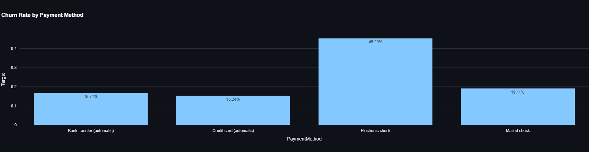
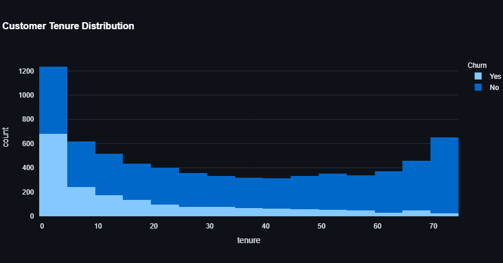
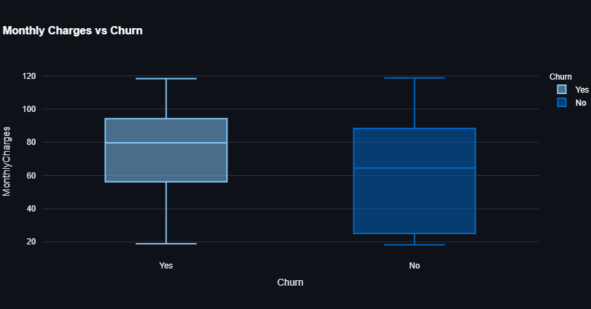
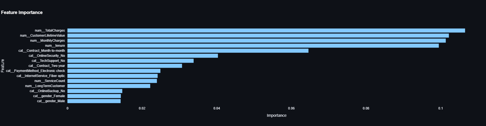
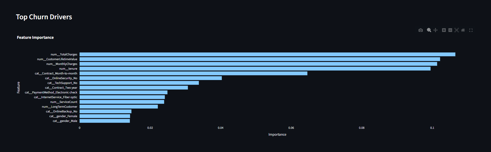
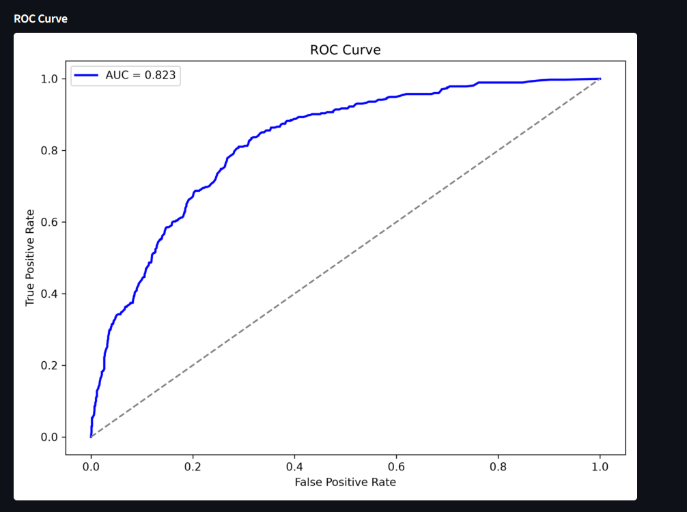
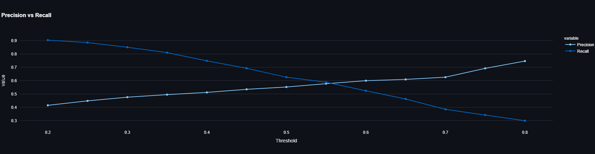

# 📊 PredictivePulse

# 📊 PredictivePulse
 
## Customer Churn Analytics & Prediction Platform
 
PredictivePulse is an end-to-end Customer Churn Analytics and Machine Learning solution built using Python, Pandas, Scikit-Learn, Plotly, and Streamlit.
 
The platform predicts customer churn, identifies retention opportunities, and provides actionable business insights through interactive visualizations and machine learning driven customer risk scoring.
 
---
 
# 🚀 Executive Dashboard
 
![Customerisk-exploree-snapsot.png
 
The Executive Dashboard provides business users with:
 
- Customer churn monitoring
- Customer risk scoring
- Model performance metrics
- Customer retention insights
- Interactive customer exploration
 
---
# 🎯 Customer Churn Analytics & Prediction Platform

PredictivePulse is an end-to-end Customer Churn Analytics and Machine Learning solution designed to identify customers at risk of leaving a telecommunications provider.

The project demonstrates the complete analytics lifecycle:

```text
Data Ingestion
      ↓
Data Cleansing
      ↓
Feature Engineering
      ↓
Exploratory Analysis
      ↓
Machine Learning
      ↓
Risk Scoring
      ↓
Interactive Dashboard
```

The objective is not only to predict churn but also to provide actionable business insights that can help customer retention teams proactively reduce customer attrition.

---

# 🚀 Business Problem

Customer churn is one of the most important metrics for subscription businesses.

When customers leave:

- Revenue decreases
- Acquisition costs increase
- Customer Lifetime Value decreases
- Business growth slows

This project answers:

- Which customers are likely to churn?
- Why are customers leaving?
- Which customer segments are most at risk?
- How can retention teams act before churn occurs?

---

# 📂 Dataset Overview

The project uses the Telco Customer Churn dataset containing information for:

```text
Total Customers: 7,043
```

The dataset includes:

### Customer Information

- Gender
- Senior Citizen
- Partner Status
- Dependents

### Services

- Internet Service
- Phone Service
- Online Security
- Online Backup
- Technical Support
- Streaming Services

### Financial Metrics

- Monthly Charges
- Total Charges
- Contract Type
- Payment Method

### Target Variable

```text
Churn (Yes / No)
```

---

# 🏗️ Solution Architecture

```text
Raw Customer Dataset
        │
        ▼
Bronze Layer
(Data Ingestion)
        │
        ▼
Silver Layer
(Data Cleansing)
        │
        ▼
Gold Layer
(Feature Engineering)
        │
        ▼
Exploratory Data Analysis
        │
        ▼
Random Forest Model
        │
        ▼
Customer Risk Scoring
        │
        ▼
Executive Dashboard
```

---

# ⚙️ Data Engineering Pipeline

## Bronze Layer

Purpose:

Store raw source data exactly as received.

### Activities

- Source validation
- Data ingestion
- Raw data preservation

---

## Silver Layer

Purpose:

Prepare clean, trustworthy data.

### Activities

- Null handling
- Datatype conversion
- Duplicate verification
- Data quality validation

### Results

```text
Records Processed : 7,043
Duplicates Found : 0
Missing Values : 0
```

---

## Gold Layer

Purpose:

Create business-ready analytical features.

### Feature Engineering

#### Customer Lifetime Value

```python
MonthlyCharges * tenure
```

Used to estimate customer value.

---

#### High Value Customer

Identifies premium-paying customers.

---

#### Long Term Customer

Identifies customers retained for 24+ months.

---

#### Service Count

Measures the number of active value-added services.

---

# 📈 Exploratory Data Analysis

The purpose of Exploratory Data Analysis was to understand customer behavior before building predictive models.

---

# Churn Rate by Contract

churn-rate-by-contract.png

### Why Analyze Contract Type?

Contract length is typically associated with customer loyalty and retention.

### What We Found

| Contract Type | Churn Rate |
|---------------|------------|
| Month-to-Month | 42.71% |
| One Year | 11.27% |
| Two Year | 2.83% |

### Business Insight

Customers on Month-to-Month contracts are significantly more likely to churn.

### Recommendation

- Encourage annual contracts
- Offer renewal incentives
- Introduce loyalty discounts

---

# Churn Rate by Internet Service

churn-rate-by-internet-service.png

### Why Analyze Internet Service?

Internet service quality and pricing often impact customer satisfaction.

### What We Found

Fiber Optic customers experience the highest churn rates.

### Business Insight

Potential causes:

- Pricing concerns
- Service quality issues
- Competitive alternatives

### Recommendation

Review service quality and customer feedback within Fiber segments.

---

# Churn Rate by Payment Method



### Why Analyze Payment Methods?

Payment behavior often reveals engagement and convenience preferences.

### What We Found

Electronic Check customers display the highest churn frequency.

### Recommendation

Encourage customers to adopt automated payment methods.

---

# Customer Tenure Distribution



### Why Analyze Tenure?

Tenure is one of the strongest indicators of customer loyalty.

### What We Found

Customers with lower tenure are considerably more likely to leave.

### Business Recommendation

Focus retention campaigns during the first 24 months.

---

# Monthly Charges vs Churn



### Why Analyze Monthly Charges?

Pricing often directly influences retention.

### What We Found

Customers with higher monthly charges tend to churn more frequently.

### Recommendation

Review pricing strategy and loyalty incentives for higher-paying customers.

---

# 🤖 Machine Learning Model

## Algorithm

```text
Random Forest Classifier
```

### Why Random Forest?

- Handles categorical and numeric features well
- Provides feature importance
- Captures non-linear relationships
- Robust against overfitting

---

# Feature Importance Analysis



The model identified the following top churn drivers:

1. Total Charges
2. Customer Lifetime Value
3. Monthly Charges
4. Tenure
5. Contract Type
6. Online Security
7. Technical Support
8. Payment Method

These variables were the strongest contributors to churn prediction.

---

# Top Churn Drivers



Understanding the top drivers allows business teams to focus retention activities where they will have the greatest impact.

---

# 📊 Model Performance

## ROC Curve



### ROC-AUC Score

```text
0.8225
```

### Interpretation

A ROC-AUC score above 0.80 indicates strong predictive capability and reliable customer classification performance.

---

# Threshold Optimization



### Why Threshold Tuning?

In churn prediction, missing a customer who is likely to leave is often more expensive than contacting a customer who would stay.

Therefore, threshold optimization was performed to balance:

- Precision
- Recall
- Retention Costs

### Recommended Threshold

```text
0.40
```

### Performance at 0.40

```text
Precision : 51.19%
Recall    : 74.87%
```

This threshold captures the majority of churning customers while maintaining reasonable prediction quality.

---

# 🚨 Customer Risk Explorer

customer-risk-exploree-snapsot.png

The dashboard includes a Customer Risk Explorer allowing business users to:

- Search customers
- Review churn probabilities
- Identify high-risk accounts
- Prioritize retention initiatives

---

# 📊 Final Results

| Metric | Result |
|----------|----------|
| Total Customers Analysed | 7,043 |
| Churn Rate | 26.54% |
| Model Accuracy | 76.58% |
| ROC-AUC Score | 0.8225 |
| Recommended Threshold | 0.40 |
| Recall @ Threshold 0.40 | 74.87% |
| High-Risk Customers Identified | 1,724 |

---

# 🏆 Key Achievements

### Data Engineering

✅ Medallion Architecture

✅ ETL Pipeline Development

✅ Data Quality Validation

✅ Feature Engineering

---

### Analytics

✅ Customer Churn Analysis

✅ Contract Analysis

✅ Internet Service Analysis

✅ Payment Method Analysis

✅ Customer Tenure Analysis

---

### Machine Learning

✅ Random Forest Classification

✅ Feature Importance Analysis

✅ ROC-AUC Evaluation

✅ Threshold Optimization

✅ Customer Risk Scoring

---

# 💼 Business Impact

The solution enables organizations to:

- Identify churn risks proactively
- Prioritize retention campaigns
- Increase customer lifetime value
- Understand customer behavior
- Focus resources on high-risk customers
- Support data-driven decision-making

---

# 🛠️ Technology Stack

```text
Python
Pandas
NumPy
Scikit-Learn
Plotly
Matplotlib
Streamlit
Joblib
GitHub
```

---

# 👨‍💻 Author

**Prashant Dwivedi**

Machine Learning | Gen AI | RAG | Data Architecture | Data Analytics | Data Engineering

🔗 GitHub: https://github.com/5H400W

🔗 LinkedIn: https://www.linkedin.com/in/prashant-dwivedi-5532b3190/

---

⭐ If you found this project useful, consider giving it a star.
 
