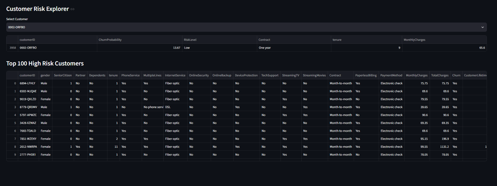
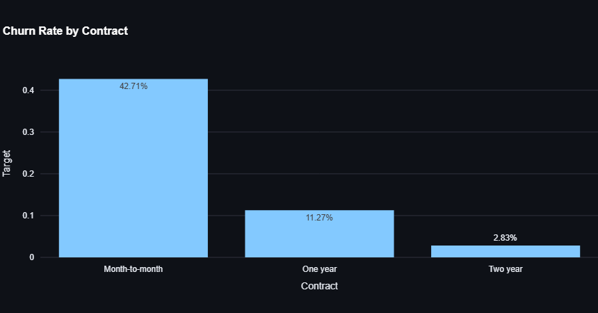
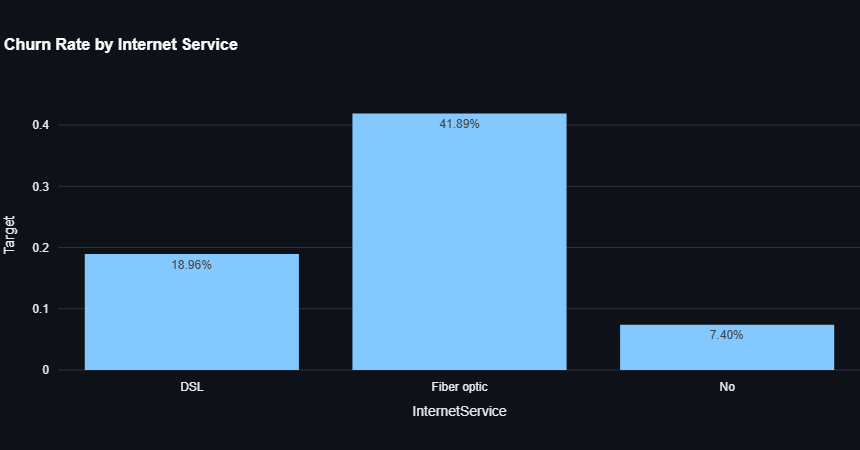

<div align="center">

# 📊 PredictivePulse

### Customer Churn Analytics & Prediction Platform

End-to-end churn analytics: Medallion data pipeline → EDA → Random Forest model → risk scoring → interactive Streamlit dashboard.




</div>

---

## 📑 Table of Contents

1. [Overview](#-overview)
2. [Business Problem](#-business-problem)
3. [Key Results](#-key-results)
4. [Dataset](#-dataset)
5. [Solution Architecture](#-solution-architecture)
6. [Data Engineering Pipeline](#-data-engineering-pipeline)
7. [Exploratory Data Analysis](#-exploratory-data-analysis)
8. [Machine Learning Model](#-machine-learning-model)
9. [Model Performance](#-model-performance)
10. [Executive Dashboard](#-executive-dashboard)
11. [Business Impact](#-business-impact)
12. [Project Structure](#-project-structure)
13. [Getting Started](#-getting-started)
14. [Technology Stack](#-technology-stack)
15. [Author](#-author)

---

## 🎯 Overview

**PredictivePulse** is an end-to-end customer churn analytics and machine learning solution built for a telecommunications provider. It covers the full analytics lifecycle, from raw data ingestion to an interactive dashboard that retention teams can use to act on churn risk.

```text
Data Ingestion → Data Cleansing → Feature Engineering → Exploratory Analysis
              → Machine Learning → Risk Scoring → Interactive Dashboard
```

The goal is not only to predict churn, but to explain **why** customers leave and give business teams actionable insight to reduce attrition proactively.

---

## 🚀 Business Problem

Churn is one of the most critical metrics for any subscription business. Every lost customer means:

- Lower recurring revenue
- Higher acquisition costs to replace them
- Reduced Customer Lifetime Value (CLV)
- Slower business growth

This project answers four questions:

1. Which customers are most likely to churn?
2. Why are customers leaving?
3. Which segments are most at risk?
4. How can retention teams act *before* churn happens?

---

## 📊 Key Results

| Metric | Result |
|---|---|
| Total Customers Analysed | 7,043 |
| Overall Churn Rate | 26.54% |
| Model Accuracy | 76.58% |
| ROC-AUC Score | 0.8225 |
| Recommended Decision Threshold | 0.40 |
| Precision @ 0.40 | 51.19% |
| Recall @ 0.40 | 74.87% |
| High-Risk Customers Identified | 1,724 |

---

## 📂 Dataset

The project uses the **Telco Customer Churn** dataset (7,043 customers).

| Category | Features |
|---|---|
| **Customer Profile** | Gender, Senior Citizen, Partner, Dependents |
| **Services** | Internet Service, Phone Service, Online Security, Online Backup, Tech Support, Streaming |
| **Financial** | Monthly Charges, Total Charges, Contract Type, Payment Method |
| **Target** | `Churn` (Yes / No) |

---

## 🏗️ Solution Architecture

```text
Raw Customer Dataset
        │
        ▼
🥉 Bronze Layer  → Data ingestion & raw preservation
        │
        ▼
🥈 Silver Layer  → Cleansing & data quality validation
        │
        ▼
🥇 Gold Layer    → Feature engineering
        │
        ▼
Exploratory Data Analysis
        │
        ▼
Random Forest Model
        │
        ▼
Customer Risk Scoring
        │
        ▼
Executive Dashboard (Streamlit)
```

---

## ⚙️ Data Engineering Pipeline

The pipeline follows the **Medallion Architecture** (Bronze → Silver → Gold).

### 🥉 Bronze Layer — Raw Ingestion

**Purpose:** Store source data exactly as received.

- Source validation
- Data ingestion
- Raw data preservation

### 🥈 Silver Layer — Cleansing & Validation

**Purpose:** Produce clean, trustworthy data.

- Null handling
- Datatype conversion
- Duplicate verification
- Data quality checks

| Check | Result |
|---|---|
| Records Processed | 7,043 |
| Duplicates Found | 0 |
| Missing Values | 0 |

### 🥇 Gold Layer — Feature Engineering

**Purpose:** Create business-ready analytical features.

| Feature | Description |
|---|---|
| `CLV` (Customer Lifetime Value) | `MonthlyCharges * tenure` — estimates customer value |
| `HighValueCustomer` | Flags premium-paying customers |
| `LongTermCustomer` | Flags customers retained for 24+ months |
| `ServiceCount` | Number of active value-added services |

---

## 📈 Exploratory Data Analysis

EDA was performed to understand customer behaviour before modelling.

### 1️⃣ Churn Rate by Contract Type



Contract length is a classic indicator of loyalty.

| Contract Type | Churn Rate |
|---|---|
| Month-to-Month | 42.71% |
| One Year | 11.27% |
| Two Year | 2.83% |

**Insight:** Month-to-Month customers are far more likely to churn.
**Recommendation:** Promote annual contracts, offer renewal incentives and loyalty discounts.

---

### 2️⃣ Churn Rate by Internet Service



**Finding:** Fiber Optic customers show the highest churn.
**Possible causes:** pricing concerns, service quality issues, competitive alternatives.
**Recommendation:** Review service quality and customer feedback within the Fiber segment.

---

### 3️⃣ Churn Rate by Payment Method


**Finding:** Electronic Check customers show the highest churn.
**Recommendation:** Encourage migration to automated payment methods (auto-debit / credit card).

---

### 4️⃣ Customer Tenure Distribution


**Finding:** Low-tenure customers are considerably more likely to leave.
**Recommendation:** Focus onboarding and retention campaigns on the first 24 months.

---

### 5️⃣ Monthly Charges vs Churn


**Finding:** Customers with higher monthly charges churn more frequently.
**Recommendation:** Review pricing strategy and introduce loyalty incentives for high-paying customers.

---

## 🤖 Machine Learning Model

**Algorithm:** Random Forest Classifier

**Why Random Forest?**

- Handles categorical and numeric features well
- Captures non-linear relationships
- Provides built-in feature importance
- Robust against overfitting

### Feature Importance


Top churn drivers identified by the model:

| Rank | Feature |
|---|---|
| 1 | Total Charges |
| 2 | Customer Lifetime Value |
| 3 | Monthly Charges |
| 4 | Tenure |
| 5 | Contract Type |
| 6 | Online Security |
| 7 | Technical Support |
| 8 | Payment Method |

### Top Churn Drivers (Dashboard View)


Understanding the main drivers lets business teams focus retention efforts where they will have the greatest impact.

---

## 📊 Model Performance

### ROC Curve


**ROC-AUC = 0.8225** — a score above 0.80 indicates strong discriminative ability between churning and retained customers.

### Threshold Optimization


In churn prediction, **missing a customer who will leave costs more than contacting one who would have stayed**. The default 0.50 threshold was therefore tuned to favour recall while keeping precision acceptable.

| Threshold | Precision | Recall |
|---|---|---|
| **0.40 (recommended)** | 51.19% | 74.87% |

At 0.40 the model captures roughly three out of four churning customers, giving retention teams a practical, cost-aware target list.

---

## 🚨 Executive Dashboard

The Streamlit dashboard gives business users a self-service view of churn risk:

- Customer churn monitoring
- Customer risk scoring
- Model performance metrics
- Retention insights
- Search and explore individual customers
- Prioritise high-risk accounts

### Customer Risk Explorer


---

## 💼 Business Impact

- Identify churn risk proactively instead of reactively
- Prioritise retention campaigns by risk score
- Increase Customer Lifetime Value
- Understand behavioural drivers of attrition
- Focus limited retention budget on high-risk customers
- Enable data-driven decision-making

---

## 🗂️ Project Structure

```text
predictivepulse-customer-churn-analytics/
├── dashboard/          # Streamlit application
├── data/               # Bronze / Silver / Gold datasets
├── src/                # Pipeline, feature engineering & model code
├── *.png               # Analysis & dashboard screenshots
├── requirements.txt    # Python dependencies
└── README.md
```

---

## ▶️ Getting Started

```bash
# 1. Clone the repository
git clone https://github.com/5H400W/predictivepulse-customer-churn-analytics.git
cd predictivepulse-customer-churn-analytics

# 2. Create and activate a virtual environment
python -m venv venv
source venv/bin/activate        # Windows: venv\Scripts\activate

# 3. Install dependencies
pip install -r requirements.txt

# 4. Launch the dashboard
streamlit run dashboard/app.py
```

---

## 🛠️ Technology Stack

| Area | Tools |
|---|---|
| Language | Python |
| Data Processing | Pandas, NumPy |
| Machine Learning | Scikit-Learn, Joblib |
| Visualization | Plotly, Matplotlib |
| Dashboard | Streamlit |
| Version Control | Git, GitHub |

---

## 👨‍💻 Author

**Prashant Dwivedi**
Data Engineering | Data Architecture | Data Analytics | Machine Learning | Gen AI | RAG

🔗 [GitHub](https://github.com/5H400W) · [LinkedIn](https://www.linkedin.com/in/prashant-dwivedi-5532b3190/)

---

⭐ If you found this project useful, consider giving it a star.
